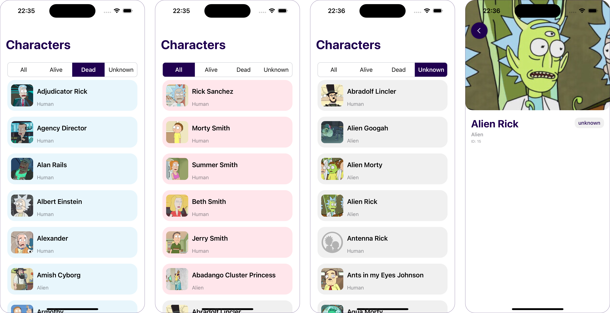

# YassirRnMUniverse (Rick and Morty Characters)



## Project Overview

The **YassirRnMUniverse (Rick and Morty Characters)** app is an iOS application that fetches data from the Rick and Morty API and displays a list of characters in a paginated manner, showing 20 characters per page. The app allows users to view details of each character, including their name, species, status, and gender.

## Features

- Fetch and display characters from the Rick and Morty API.
- Pagination for loading 20 characters per page.
- Filtering characters by their status: Alive, Dead, or Unknown.
- View detailed information about each character, including name, species, gender, and status.
- Custom UI using a combination of UIKit for table views and SwiftUI for detailed views.
- Image caching to optimize network performance.

## Requirements

- iOS 13.0+
- Xcode 12.0+
- Swift 5.0+

## Setup Instructions

1. **Clone the Repository:**

    ```bash
    git clone https://github.com/texyz/RickAndMortyCharactersApp.git
    cd RickAndMortyCharactersApp
    ```

2. **Open in Xcode:**

   - Open the `.xcodeproj` or `.xcworkspace` file in Xcode.

3. **Build the Project:**

   - Select your target device or simulator in Xcode and press `Cmd + R` to build and run the project.

## Running Tests

- To run the unit and UI tests, select the test target in Xcode and press `Cmd + U`.

## Assumptions and Decisions

- **Architecture:** The project is structured using MVVM (Model-View-ViewModel) to separate concerns and improve maintainability.
- **API Pagination:** We assume that the API returns 20 characters per page, which is then handled by the `fetchCharacters()` function in the ViewModel.
- **Image Caching:** To improve performance and reduce network load, images are cached using `NSCache`.
- **Network Handling:** The application uses Combine for reactive network handling, ensuring smooth data fetching and UI updates.

## Challenges Encountered

1. **Network Delays and Pagination:**

   - **Issue:** Handling pagination and ensuring the app fetches exactly 20 characters per page was challenging due to potential network delays.
   - **Solution:** Implemented a recursive fetch approach to ensure exactly 20 characters are loaded before displaying them to the user.

2. **Combining UIKit and SwiftUI:**

   - **Issue:** Integrating SwiftUI views into a UIKit-based application while maintaining a consistent and responsive user interface.
   - **Solution:** Used `UIHostingController` to embed SwiftUI views into the UIKit hierarchy, ensuring smooth transitions and interactions.

3. **UI Test Reliability:**

   - **Issue:** UI tests occasionally failed due to timing issues, such as waiting for elements to appear or become tappable.
   - **Solution:** Implemented `XCTExpectations` with appropriate timeouts to wait for UI elements to be in the expected state before proceeding with assertions.

## License

This project is licensed under the MIT License. See the [LICENSE](LICENSE) file for details.

## Contact

For any questions or issues, feel free to reach out via [GitHub Issues](https://github.com/texyz/RickAndMortyCharactersApp/issues).
